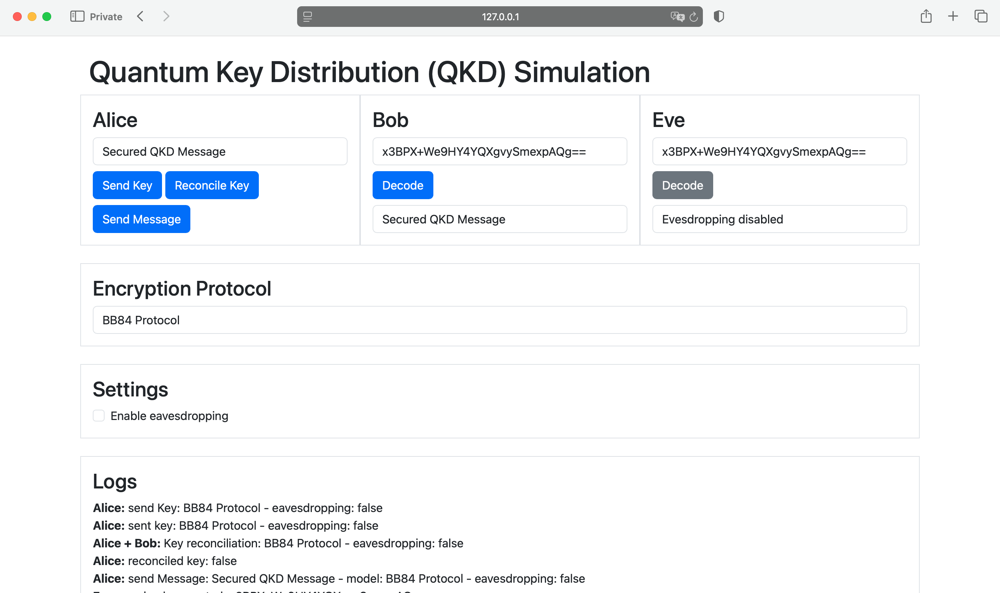

# Quantum Key Distribution (QKD) Simulation

This repository simulates different quantum key distribution (QKD) methods:

- No encryption
- BB84 Protocol
- Ekert Protocol

To get started with these simulations:
1. Clone the repository:
   ```
   git clone https://github.com/azimonti/quantum-key-distribution-simulation.git
   ```
2. Navigate to the repository directory:
   ```
   cd quantum-key-distribution-simulation
   ```
3. Install required dependencies (a virtual environment can be created running the script `create_env.sh`):
   ```
   pip install -r requirements.txt
   ```
4. Change `SECRET_KEY` in `config.json` (it is set as example for development purposes)
5 . Run the simulation scripts:
   ```
   python app.py
   ```

## Simulations

All the simulations rely on one-time pad cryptography, which is absolutely secured. Therefore the encrypted message is always broadcasted on a a public channel and Eve can capture it.

The difference is how the secret key is exchanged and what is the behavior when an eavesdropper is intercepting the key and what Alice and Bob do to ensure that the key is not leaked.



### No Protocol

In the case where no encryption protocol is used, there is no reconciliation between Bob and Alice, and if an eavesdropper is present, just hold a valid copy of the key and can decode the message without Alice or Bob noticing it.

### BB84

The BB84 protocol uses quantum mechanics for key exchange. Alice sends a sequence of qubits to Bob, randomly encoding each bit using one of two bases (e.g., rectilinear {0°, 90°} or diagonal {45°, 135°}). Bob measures each incoming qubit randomly in one of the two bases.

After the transmission, Alice and Bob communicate over a public channel to reveal which basis they used for each qubit, discarding measurements where they used different bases. They then publicly compare a subset of the remaining bits. If an eavesdropper (Eve) intercepted and measured the qubits, she inevitably introduced errors because she did not know the original basis used by Alice. If the error rate exceeds a certain threshold, Alice and Bob discard the key, suspecting eavesdropping. Otherwise, they use the remaining agreed-upon bits (after error correction and privacy amplification) as their secret key.

### Ekert

The Ekert protocol leverages quantum entanglement for key distribution. A source generates entangled qubit pairs (e.g., in a Bell state), sending one qubit to Alice and the other to Bob. Alice and Bob independently measure their qubits using randomly chosen measurement settings (bases/angles) from predefined sets.

After measuring a sufficient number of pairs, Alice and Bob publicly announce their chosen measurement settings for each pair. To detect eavesdropping, they use a subset of the results where their settings differed appropriately to perform a Bell test (like checking the CHSH inequality). A significant violation of the inequality confirms the expected quantum correlations and implies security. If the test fails, they assume an eavesdropper was present and abort. For the remaining pairs where they used compatible settings (e.g., the same angle in this implementation) and passed the security check, their measurement outcomes are correlated and form the raw key bits, which are then processed via error correction and privacy amplification.

## Contributing

Contributions to the Quantum Key Distribution Simulation project are welcome. Whether it's through submitting bug reports, proposing new features, or contributing to the code, your help is appreciated. For major changes, please open an issue first to discuss what you would like to change.

## License

This project is licensed under the MIT License - see the [LICENSE](LICENSE) file for details.

## Contact

If you have any questions or want to get in touch regarding the project, please open an issue or contact the repository maintainers directly through GitHub.
